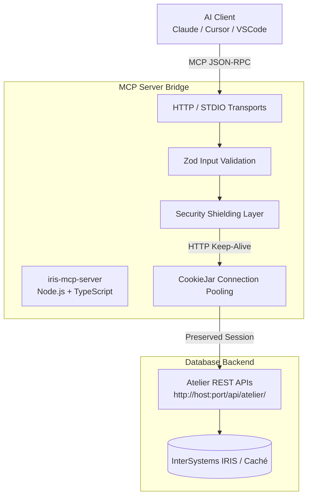

# InterSystems IRIS Model Context Protocol (MCP) Server

[](https://opensource.org/licenses/MIT)
[](https://www.typescriptlang.org/)
[](https://modelcontextprotocol.io)

A production-ready Model Context Protocol (MCP) server that empowers LLM agents (such as Claude, Cursor, or VS Code) to securely interact with InterSystems IRIS and Caché database source code over **Atelier REST APIs**. 

By bringing high-context code understanding, class compilation, Git synchronization, and structured interoperability diagnostics to AI tools, this server allows your AI coding assistants to write, analyze, and build IRIS ObjectScript code directly inside your database instance.

---

## 🏗️ Architecture

The server acts as a stateless translation bridge between the Model Context Protocol (used by AI clients) and the official InterSystems Atelier REST API:



---

## ✨ Features

- **Class & Routine Management**: Read, save, and update ObjectScript classes (`.cls`) and routines (`.mac`, `.int`, `.inc`, etc.).
- **Smart Compilation & Diagnostics**: Trigger remote compilations directly and return clean, structured compilation success/failure diagnostics.
- **Interoperability / Ensemble Diagnostics**: Fetch active Productions, search HL7 and application messages, pull message traces, and view routing rules via SQL queries translated into MCP tools.
- **Git & Local Workspace Sync**: Bidirectionally sync your entire namespace down to a local Git directory (`sync_from_iris`, `sync_to_iris`), compare file diffs to resolve conflicts, and run a persistent `watcher` daemon to auto-deploy local saves.
- **Deep Source Search**: Search ObjectScript codebases with a robust regex engine, matching wildcards, case sensitivity, and system-level files.
- **Metadata Inspection**: Fetch namespace details and retrieve structural index maps (methods, parameters, properties) of classes/routines.
- **Advanced Security & Protection**:
  - **Shielded System Files**: Rejects mutations to critical system files like `%SYS.*`, `%Dictionary.*`, and other namespace-level protected classes.
  - **Configured Namespace Jail**: Isolates the MCP server strictly to the namespace configured in your environment variable.
  - **License Optimized**: Utilizes Node.js HTTP Keep-Alive alongside a `tough-cookie` CookieJar to preserve IRIS sessions, dramatically reducing license exhaustion.
- **Dual Transport Mechanisms**:
  - **Streamable HTTP Mode**: Designed for remote deployments and multiple client integrations.
  - **STDIO Mode**: Designed for local development and direct desktop tool integrations (e.g., Claude Desktop).

---

## 📋 Prerequisites

- **Node.js**: `v20.x` or higher.
- **InterSystems IRIS/Caché**: An active instance with the **Atelier REST API** enabled (typically exposed on `/api/atelier/` web application).
- **Atelier-enabled User**: An IRIS user account with proper permission to read/write/compile source documents and query `Ens_Config` and `Ens` SQL tables in the designated namespace.

---

## 🚀 Getting Started

### 1. Installation
Clone the repository and install dependencies:
```bash
git clone https://github.com/muthu0044/iris-mcp-server.git
cd iris-mcp-server
npm install
```

### 2. Configure Environment Variables
Copy the `.env.example` file to `.env`:
```bash
cp .env.example .env
```
Fill out the variables in `.env` based on your IRIS instance configuration:
```env
PORT=3000
IRIS_BASE_URL=http://localhost:52773/api/atelier/
IRIS_API_VERSION=v8
IRIS_NAMESPACE=USER
IRIS_USERNAME=superuser
IRIS_PASSWORD=sys
IRIS_REQUEST_TIMEOUT_MS=10000
IRIS_MAX_RETRIES=1
IRIS_LOCAL_WORKSPACE=./workspace
LOG_LEVEL=info
MCP_SERVER_NAME=iris-mcp-server
MCP_SERVER_VERSION=1.0.0
MAX_SOURCE_PAYLOAD_BYTES=1048576
```

### 3. Running the Server

#### Development Mode (Hot Reloading)
```bash
npm run dev
```

#### Production Build & Execution
Build the TypeScript source and start the server:
```bash
npm run build
npm start
```
By default, this launches the **Streamable HTTP Server** on `http://localhost:3000` with the MCP endpoint listening at `http://localhost:3000/mcp`.

#### STDIO Local Transport Mode
To run the server over standard input/output (ideal for Claude Desktop):
```bash
npm run start:stdio
```

#### Running the Local Watcher
To automatically sync local file edits in your workspace directory straight to your IRIS server:
```bash
npm run watch
```

---

## 🔧 Environment Configuration

| Variable | Description | Default | Zod Constraint / Type |
|---|---|---|---|
| `PORT` | The port the HTTP server will bind to. | `3000` | Positive Integer |
| `IRIS_BASE_URL` | Base endpoint of the Atelier REST API. | `http://localhost:52773/api/atelier/` | Valid URL String |
| `IRIS_API_VERSION` | Atelier API version string. | `v8` | Matches `v\d+` (case-insensitive) |
| `IRIS_NAMESPACE` | Target namespace to restrict operations. | `USER` | Min 1 character |
| `IRIS_USERNAME` | IRIS username for Basic Authentication. | *Required* | Min 1 character |
| `IRIS_PASSWORD` | IRIS password for Basic Authentication. | *Required* | Min 1 character |
| `IRIS_REQUEST_TIMEOUT_MS`| Request timeout for Atelier API connections. | `10000` | Positive Integer (milliseconds) |
| `IRIS_MAX_RETRIES` | Max connection retries on Axios errors. | `1` | Integer between `0` and `5` |
| `IRIS_LOCAL_WORKSPACE` | Path to your local Git directory for sync operations. | `./workspace` | Valid Directory Path |
| `LOG_LEVEL` | Level of server logs (via `pino`). | `info` | String |
| `MCP_SERVER_NAME` | Self-identifying name of the MCP server. | `iris-mcp-server` | Min 1 character |
| `MCP_SERVER_VERSION` | Semantic version of the MCP server. | `1.0.0` | Min 1 character |
| `MAX_SOURCE_PAYLOAD_BYTES`| Maximum permitted size for classes/routines. | `1048576` (1MB) | Positive Integer (bytes) |

---

## 🛠️ Exposed MCP Tools Reference

Here are the core tools this MCP server registers with AI clients, grouped by category:

### Base Atelier Tools
- **`ping`**: Verifies connectivity and status between the MCP server and your environment.
- **`get_namespace_metadata`**: Retrieves namespace system parameters and configuration.
- **`get_document_index`**: Retrieves syntax trees, methods, parameters, and properties index for a given document.
- **`search_text`**: Fast server-side regex and string search across the IRIS namespace codebase.

### Source Code CRUD Tools
- **`list_classes`**: Lists class source documents, filterable by package.
- **`get_class` / `get_routine`**: Retrieves full source code content for a class or routine.
- **`save_class` / `save_routine`**: Creates or updates class or routine source code.
- **`compile_class`**: Triggers remote compilation of a class, returning detailed compilation messages.

### Interoperability & Ensemble Diagnostics Tools
- **`get_productions`**: Lists all active Interoperability Productions on the IRIS server.
- **`search_messages`**: Searches `Ens.MessageHeader` records to find HL7/application messages by Session ID, Source, or Target.
- **`get_message_trace`**: Extracts the visual trace of a message across components using its Session ID.
- **`get_routing_rules`**: Lists configured routing rules in the namespace.

### Local Workspace & Sync Tools
- **`sync_from_iris`**: Bulk downloads all classes and routines from the IRIS namespace to the designated local workspace folder. (Safe 404 skipping included).
- **`sync_to_iris`**: Recurses a local workspace directory and bulk uploads/saves all detected class and routine files into IRIS.
- **`compare_iris_file`**: Computes a live content comparison between a local file and its counterpart on the live IRIS database to facilitate AI-driven git conflict resolutions.

---

## 🔒 Security Shielding & Guardrails

The server implements strict guardrails to protect your database server from accidental overwrite or exploitation:
1. **Protected System Files Block**: The server parses incoming names in `save_class` and `save_routine`. If the target starts with `%SYS.`, `%Dictionary.`, or matches `%SYS`, the server immediately throws a `PROTECTED_CLASS` error and rejects the write.
2. **Namespace Isolation**: All operations are routed directly to the isolated namespace configured in `IRIS_NAMESPACE`. The server does not support cross-namespace dynamic queries, ensuring security boundaries.
3. **Payload Sanitization**: Payloads are checked prior to dispatching to the IRIS database. If code content exceeds the configured `MAX_SOURCE_PAYLOAD_BYTES` limit, execution is safely halted.
4. **License Pooling**: Uses internal Cookie Jars and HTTP Keep-Alive to maintain a single session footprint against your database, rather than exhausting your available user licenses.

---

## 🤖 Claude Desktop Integration

To register this server with your local Claude Desktop app, edit your configuration file:

* **Windows**: `%APPDATA%\Claude\claude_desktop_config.json`
* **macOS**: `~/Library/Application Support/Claude/claude_desktop_config.json`

### Local STDIO Mode (Recommended)
This uses your compiled Node.js application locally through a standard input/output pipe:

```json
{
  "mcpServers": {
    "iris-mcp-server": {
      "command": "node",
      "args": [
        "C:/path/to/iris-mcp-server/build/index.js",
        "--stdio"
      ],
      "env": {
        "IRIS_BASE_URL": "http://localhost:52773/api/atelier/",
        "IRIS_API_VERSION": "v8",
        "IRIS_NAMESPACE": "USER",
        "IRIS_USERNAME": "superuser",
        "IRIS_PASSWORD": "sys",
        "IRIS_REQUEST_TIMEOUT_MS": "10000",
        "IRIS_MAX_RETRIES": "1",
        "IRIS_LOCAL_WORKSPACE": "./workspace",
        "LOG_LEVEL": "info",
        "MAX_SOURCE_PAYLOAD_BYTES": "1048576"
      }
    }
  }
}
```

---

## 🗺️ Roadmap & Future Planning

We have laid out a phased roadmap to turn this server into an all-encompassing suite for AI-driven InterSystems IRIS development:

### 🚀 Phase 1: Core Operations (Completed)
- [x] Complete Atelier API wrapper client with resilient connectivity.
- [x] Document CRUD capabilities for classes and routines.
- [x] Remote compilation invocation and diagnostic extraction.
- [x] Codebase-wide full text and regex search tools.
- [x] Environment configuration validation via Zod schemas.

### 🔄 Phase 2: Git Integration & Local Synchronizers (Completed)
- [x] **Git Synchronization**: Synchronize classes/routines between a local Git repository and your IRIS database workspace directly.
- [x] **Workspace Sync Watcher**: A directory watch script that auto-pushes file edits directly to the database in real-time.
- [x] **Conflict Resolution Tool**: AI-assisted comparison of conflicts when database classes differ from local repository files.

### 🌐 Phase 3: Structural Diagnostics & Advanced Domain Tools (Completed)
- [x] **Global Inspection Tool**: A read-only inspector for IRIS Globals via direct query execution mapping.
- [x] **HL7 Routing & Interoperability Tools**: MCP endpoints to inspect, search, and trace messages, productions, routing rules, and architectures via SQL mapping.
- [x] **Production Inspector**: Retrieve the state and status of active IRIS Interoperability productions.

### 🧠 Phase 4: Autonomous Diagnostics & Refactoring (Upcoming)
- [ ] **Auto-linting & AI Refactoring**: Suggest code modifications based on ObjectScript design principles and performance optimization guidelines.
- [ ] **System Health & Logs Inspector**: Provide AI access to IRIS system logs (`messages.log`) and event logs to diagnose database errors autonomously.
- [ ] **Dependency Graph Engine**: Tooling that builds a DAG (Directed Acyclic Graph) of compilation dependencies for class structures.

---

## 📄 License

This project is licensed under the [MIT License](LICENSE). Contributions, bug reports, and pull requests are welcome!
